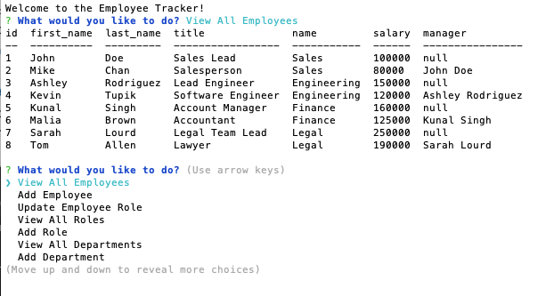

# employee-tracker
  [](https://opensource.org/licenses/MIT)

  ## Description
  This command line application allows the user to interact with a database to keep track of their employees. The user can add departments, roles, and employees as well as view tables of this data.

  ## Table of Contents

  ♦︎[Installation](#installation)

  ♦︎[Usage](#usage)

  ♦︎[Questions](#questions)

  ## Installation

  To install the necessary dependencies, run the following command:

  ```
  npm i
  ```

  To initialize the database, log in to the mysql shell and run
  ```
  source db/schema.sql
  ```
  A sample data set is provided and can be used by running
  ```
  source db/seeds.sql
  ```

  ## Usage

  After installing dependencies as described above, the application can be launched in the terminal with ```node index.js``` . Once the application starts the user will be able to select to add or view employees, roles, and departments, as well as update an employee's role by following the provided prompts. A walkthrough video of the application can be found [here.](https://watch.screencastify.com/v/AOqIlojqrjpBIVqomGlk)
  
  

  ## License

  This project is licensed under the [MIT](https://opensource.org/licenses/MIT) license.


  ## Questions

  If you have any questions about the repo, open and issue or contact me directly at braddwagner@outlook.com. You can find more of my work on my [GitHub](https://github.com/braddwagner)